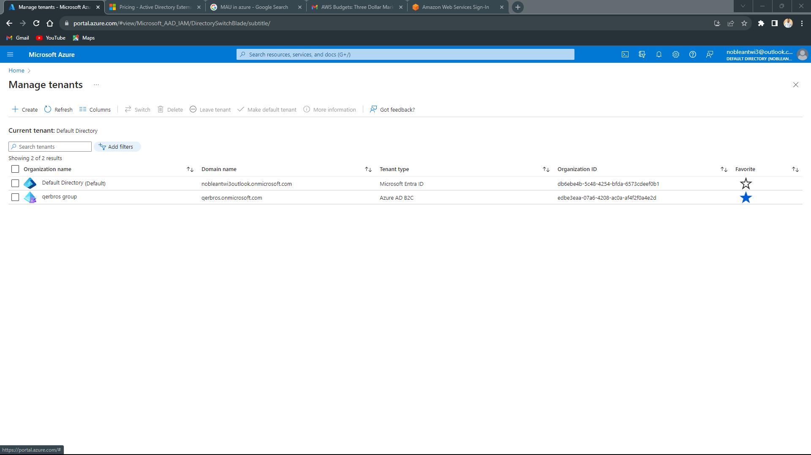
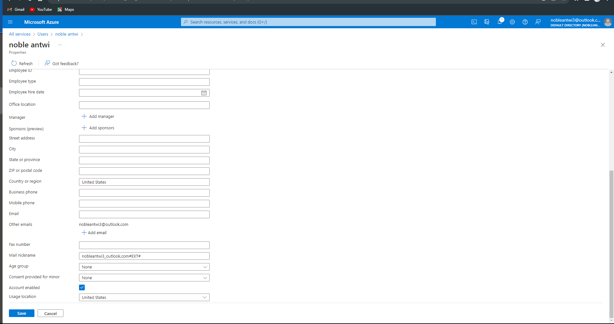
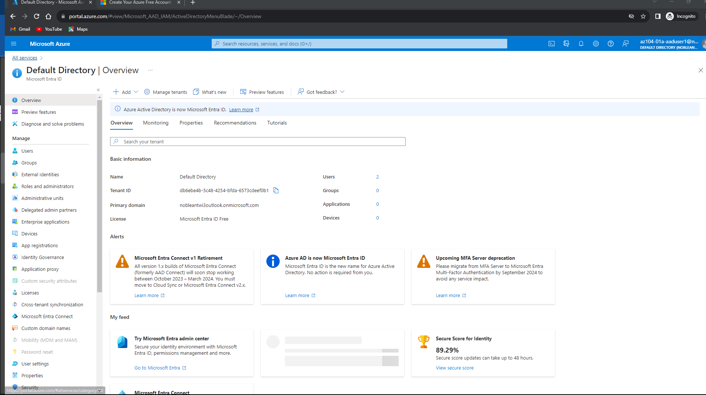
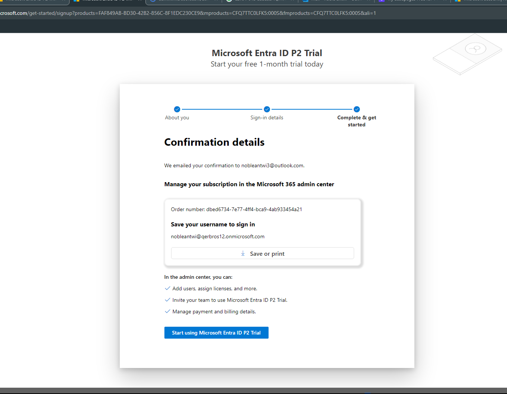
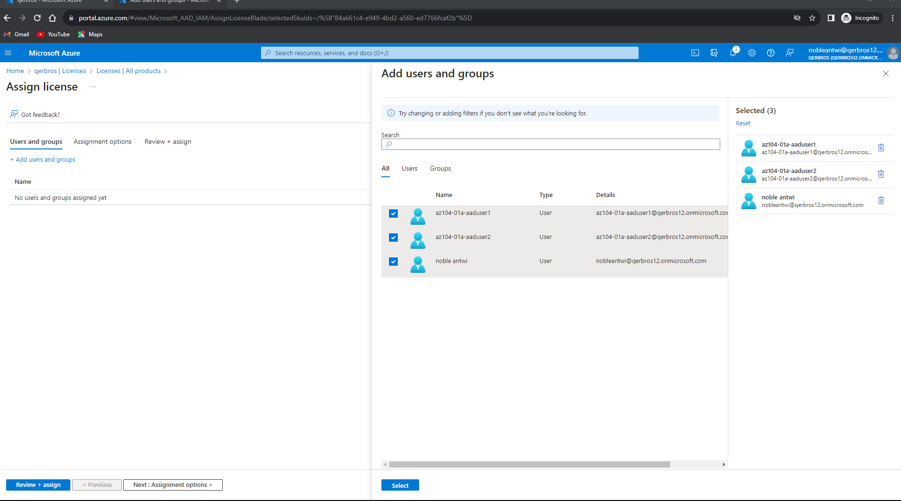
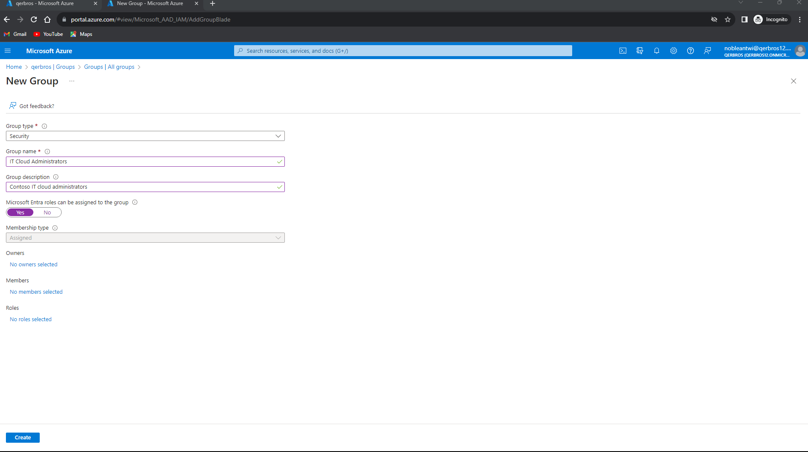
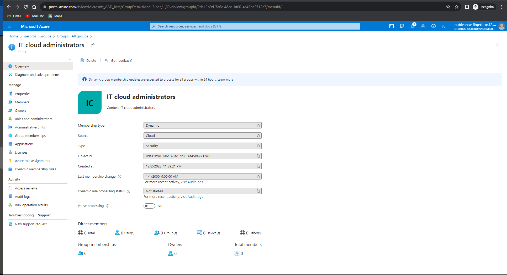

# Azure Identity Management and Group Configuration with Microsoft Entra ID

## Introduction:

This project dives into Azure's identity management and group configuration using Microsoft Entra ID within the Contoso environment. The journey involved user provisioning, role assignment, and the creation of dynamic and assigned membership groups for streamlined access control and management.

The Lab Content can be found on [Github](https://github.com/MicrosoftLearning/AZ-104-MicrosoftAzureAdministrator/blob/master/Instructions/Labs/LAB_01-Manage_Entra_ID_Identities.md) or by the [Website](https://microsoftlearning.github.io/AZ-104-MicrosoftAzureAdministrator/)

## User Provisioning and Role Assignment:

The project commenced by creating two distinct users - az104-01a-aaduser1 and az104-01a-aaduser2.

 Each user was meticulously configured with specific attributes such as job title, department, and usage location within the Azure portal, mirroring real-world scenarios. 
 
 
 
 Notably, az104-01a-aaduser1 was assigned the User Administrator role, granting elevated permissions for user management tasks within the Azure environment.
 

The process of signing in via an InPrivate browser window using the newly created user account (az104-01a-aaduser1) to access the Microsoft Entra ID tenant offered insights into access control nuances. Although access to the tenant was granted, explicit access to Azure resources remained restricted, adhering to Azure's Role-Based Access Control principles.

## Dynamic Group Creation and License Activation:

Activation of Microsoft Entra ID Premium P2 licenses was imperative to implement dynamic groups, enriching the identity management ecosystem. 

The license activation and assignment process, including verifying license activation post-refresh, underscored the importance of license management for enhanced Azure identity functionalities.

Creating dynamic groups such as 'IT Cloud Administrators' and 'IT System Administrators' based on job titles reflected the agility of dynamic membership configuration. Configuring dynamic membership rules based on specific job titles showcased the automated process of populating groups, aligning user roles with job functionalities seamlessly.

Simultaneously, an assigned membership group, 'IT Lab Administrators,' was created, emphasizing the balance between dynamic and explicitly assigned memberships within the identity structure.

## Conclusion:

This project encapsulated an immersive journey into Azure's identity management realm, showcasing the provisioning of users, role assignments, and the creation of dynamic and assigned groups within the Microsoft Entra ID ecosystem. The hands-on experience underscored the significance of identity governance and access control, setting the stage for a deeper exploration of Azure's identity and access management capabilities.