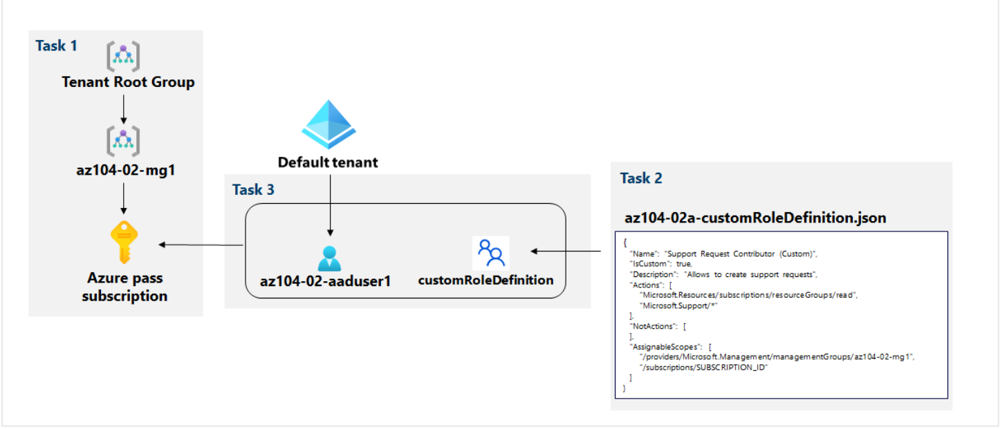
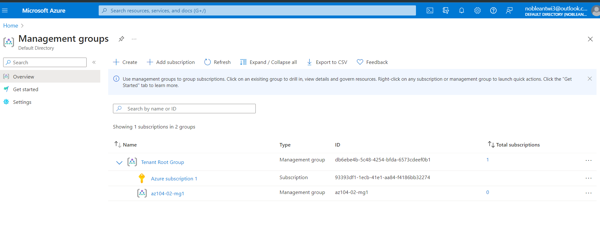
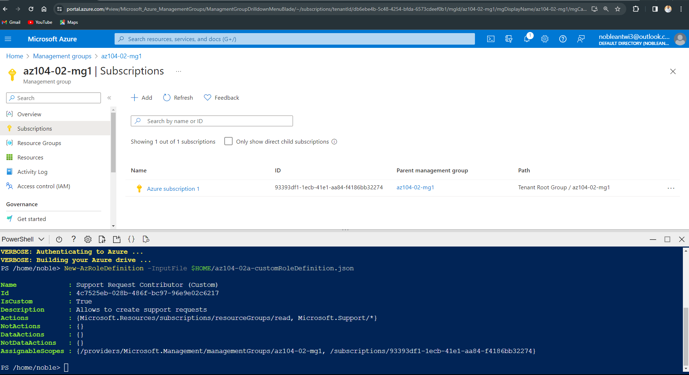
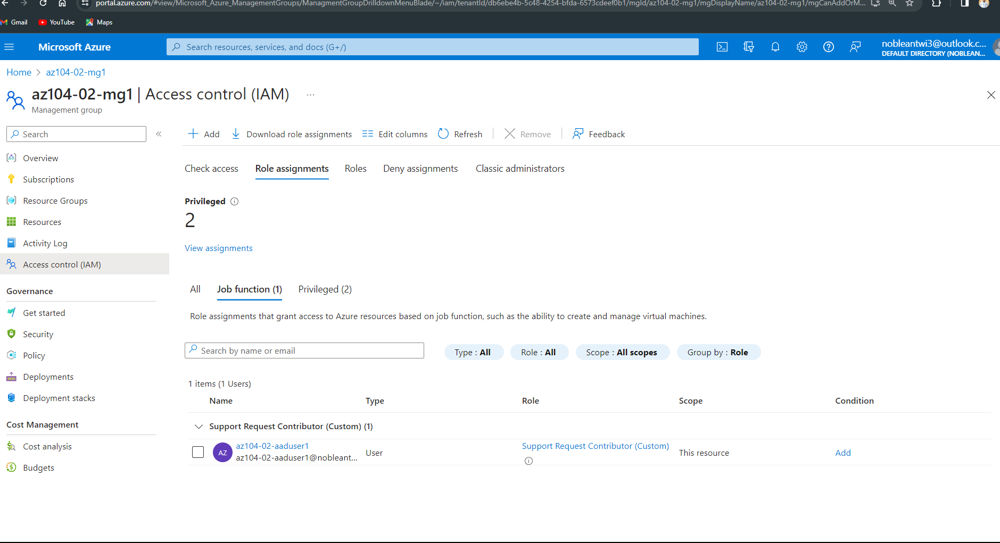
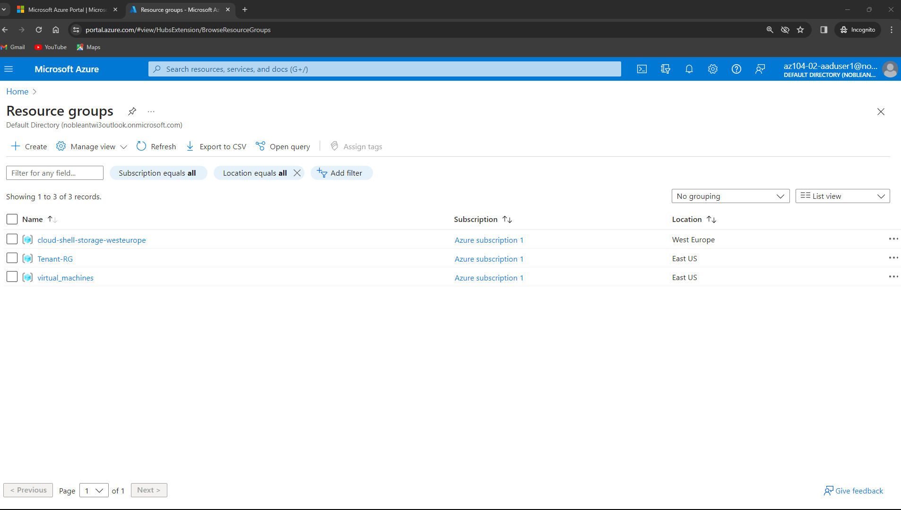
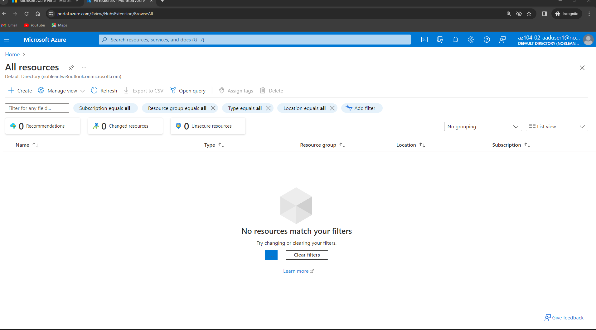
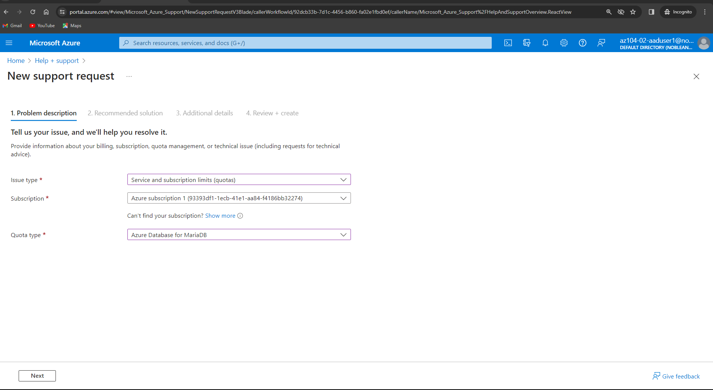
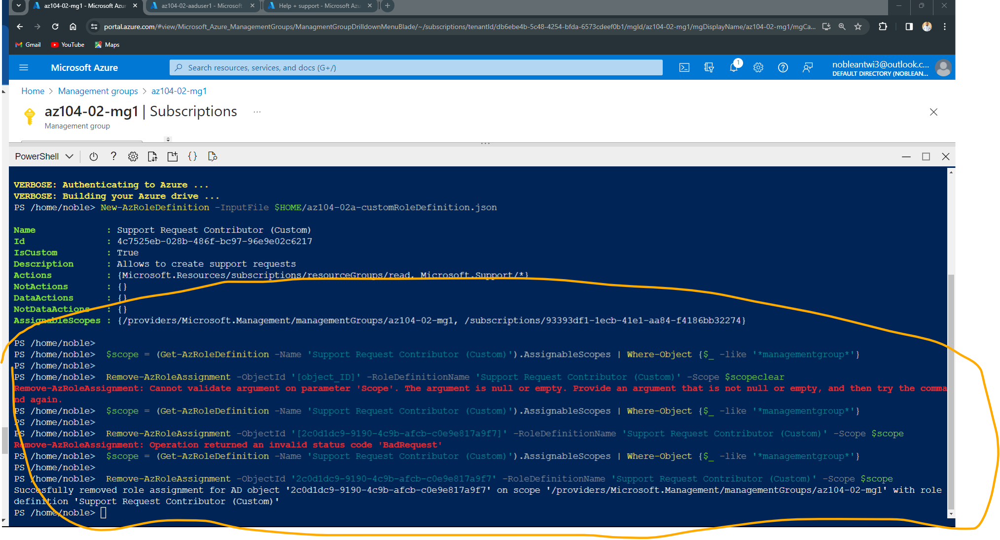
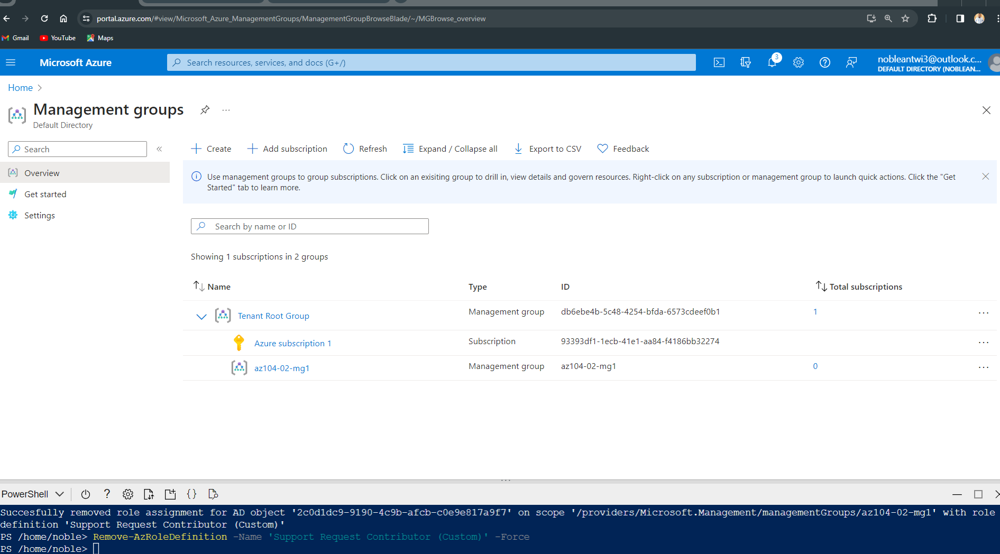

# Azure Administration and RBAC Implementation

## Introduction

The goal of this project was to enhance the management of Azure resources within the Contoso organization by implementing Management Groups and custom Role-Based Access Control (RBAC) roles. The key objectives included creating a management group to consolidate Azure subscriptions, granting specific permissions for support requests, and verifying the assigned roles.

### Architectural Diagram


The Lab Content can be found on [Github](https://github.com/MicrosoftLearning/AZ-104-MicrosoftAzureAdministrator/blob/master/Instructions/Labs/LAB_01-Manage_Entra_ID_Identities.md) or by the [Website](https://microsoftlearning.github.io/AZ-104-MicrosoftAzureAdministrator/)

## Implement Management Groups

Upon accessing the Azure portal, the initial step involved the creation of a management group named "az104-02-mg1" with the associated ID.



 This management group was strategically designed to consolidate various Azure subscriptions. To ensure a seamless process, potential permission hurdles were addressed by updating the directory admin properties. The successful creation of this management group marked a pivotal step in enhancing resource organization and management.

## Create Custom RBAC Roles

The creation of custom RBAC roles was undertaken to tailor permissions according to the specific needs of the organization. A JSON document was meticulously crafted, defining a custom role named "Support Request Contributor (Custom)." 

```JSON
{
   "Name": "Support Request Contributor (Custom)",
   "IsCustom": true,
   "Description": "Allows to create support requests",
   "Actions": [
       "Microsoft.Resources/subscriptions/resourceGroups/read",
       "Microsoft.Support/*"
   ],
   "NotActions": [
   ],
   "AssignableScopes": [
       "/providers/Microsoft.Management/managementGroups/az104-02-mg1",
       "/subscriptions/93393df1-1ecb-41e1-aa84-f4186bb32274"
   ]
}

```
This role was designed to encompass actions such as reading resource groups and creating support requests. Importantly, the scope of this custom role was limited to the newly established management group and a specific Azure subscription.



The execution of the role creation process was facilitated through Azure Cloud Shell using PowerShell. The script, utilizing the provided JSON document, seamlessly generated the custom RBAC role. The PowerShell script served as a critical component, translating the defined permissions into actionable roles within the Azure environment.

## Assign RBAC Roles
User-centric actions were pivotal in the next phase of the project. A new user, "az104-02-aaduser1," was created with password authentication enabled. This user was subsequently granted the custom RBAC role within the designated management group. 


Verification steps were taken to ensure that the user had the ability to view resource groups, thus confirming the efficacy of the assigned custom role.

The user's permissions were deliberately restricted to prevent access to individual resources, aligning with the principle of least privilege. 



This approach not only enhanced security but also demonstrated a thoughtful implementation of RBAC to cater to specific operational requirements. 




The final validation involved logging in with the newly created user and successfully creating a support request, affirming the precise alignment of permissions with the organizational goals.


## Resource Cleanup Process

In the final phase of the Azure project, the focus is on systematically cleaning up resources to revert the Azure environment to its pre-project state. This comprehensive cleanup is essential to ensure efficient resource management, enhance security, and remove any configurations introduced during the project's tasks.

### User De-provisioning

Navigating to the Azure portal, the cleanup process starts by accessing the Users - All users blade under Microsoft Entra ID. The specific user account for this project, "az104-02-aaduser1," is selected for de-provisioning. The Object ID attribute value is then copied from the az104-02-aaduser1 - Profile blade.

### Role Assignment Removal

```JSON
 $scope = (Get-AzRoleDefinition -Name 'Support Request Contributor (Custom)').AssignableScopes | Where-Object {$_ -like '*managementgroup*'}
    
 Remove-AzRoleAssignment -ObjectId '2c0d1dc9-9190-4c9b-afcb-c0e9e817a9f7' -RoleDefinitionName 'Support Request Contributor (Custom)' -Scope $scope
```

Transitioning to the Azure Cloud Shell for efficient management, PowerShell commands are utilized to remove the custom RBAC role assignment for "az104-02-aaduser1." Subsequently, the custom RBAC role definition itself is removed, ensuring a complete elimination of the assigned permissions.



### User Account Deletion

Returning to the Azure portal, the user account "az104-02-aaduser1" is permanently deleted from the Users - All users blade under Microsoft Entra ID.

### Management Group Cleanup

### Subscription Repositioning

Within the Management groups blade, the Azure subscription previously placed under the "az104-02-mg1" management group is strategically moved to the Tenant Root management group. Verification of the successful subscription move is confirmed through a subsequent refresh of the Management groups blade.



### Management Group Deletion

The final step involves the deletion of the temporary management group, "az104-02-mg1," created during the project. This action ensures the complete removal of the organizational structure established for the specific needs of the project.

## Conclusion

In summary, the completion of the Azure administration and RBAC implementation project has significantly enhanced Contoso's management of Azure resources. The establishment of the "az104-02-mg1" management group provided a centralized structure, streamlining the organization of multiple subscriptions for improved governance. The development and application of custom RBAC roles, exemplified through the user "az104-02-aaduser1," demonstrated precise permissions, aligning with the principle of least privilege.

Furthermore, the meticulous resource cleanup process ensured the elimination of temporary entities, leaving the Azure environment in a pristine state. As Contoso continues its Azure journey, the project's insights will serve as a foundation for ongoing optimizations, emphasizing the importance of continuous monitoring, periodic reviews of RBAC roles, and adjustments to the organizational structure to meet evolving business needs. Ultimately, this project underscores Contoso's commitment to implementing Azure best practices, fostering a secure, well-organized, and scalable cloud environment.

