# Managing Governance via Azure Policy

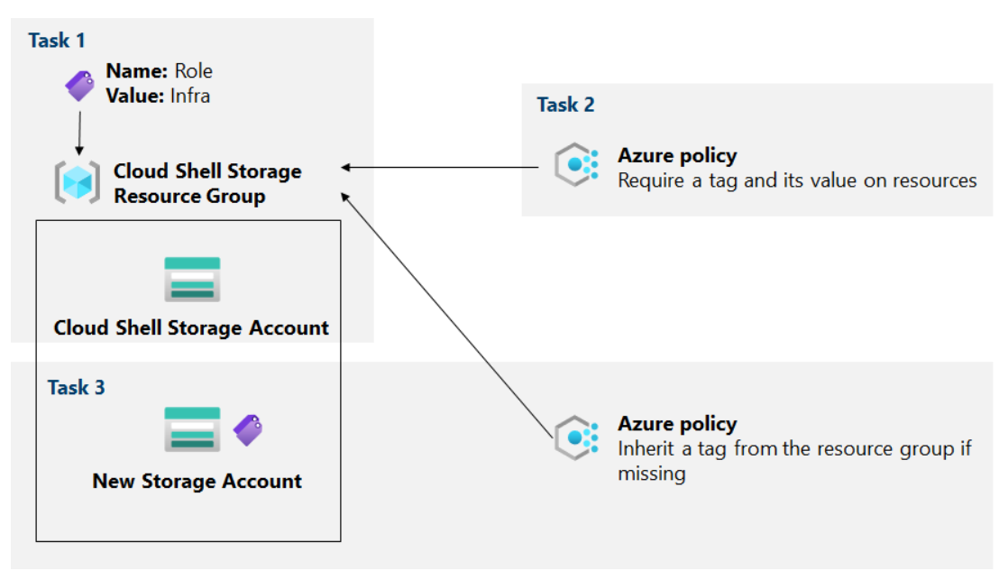

## Introduction

Welcome to my Azure governance project! This venture was aimed at enhancing resource management within Contoso by implementing robust governance strategies via Azure Policy. Ensuring proper tagging and compliance became the focal point of this endeavor.

## Project Scenario

At Contoso, the need to efficiently manage Azure resources prompted the pursuit of the following objectives:

* Tagging resource groups with infrastructure resources
* Enforcing tagging compliance via Azure Policy
* Applying tagging through remediation via Azure Policy

Delving into the world of Azure governance, I set out to achieve these objectives to streamline resource management and ensure compliance across the board.

## Portal - Personalised Tagging Adventure.

Embarking on the first task of our tagging adventure, I'll guide you through the process of creating and assigning tags to an Azure resource group. Join me as I share the steps and insights gained along this personalized journey.

To start, I navigated to the Azure portal and dove into a PowerShell session within the Cloud Shell, gaining a sense of behind-the-scenes operations. In case the "You have no storage mounted" message popped up, a simple solution was to select the lab's subscription and click 'Create storage,' resembling the setup of a personalized workspace.

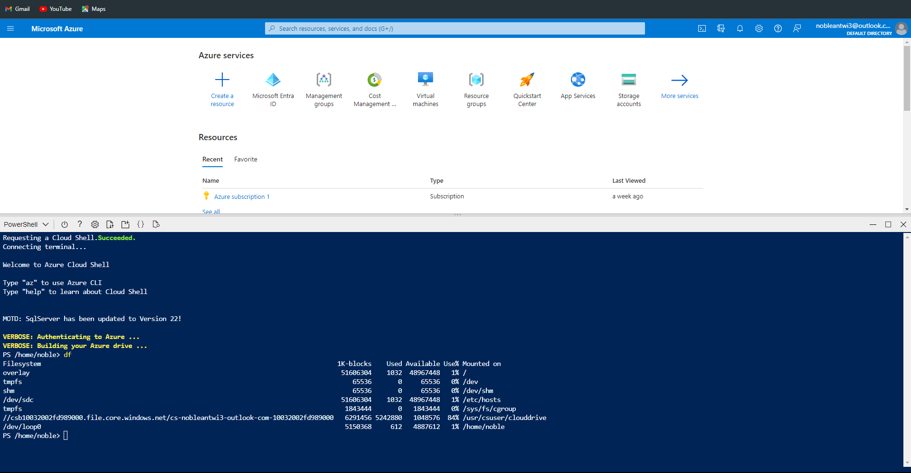

Executing a straightforward command, 'df,' in the Cloud Shell unveiled the name of the storage account working behind the scenes. This simple magic trick allowed me to identify the Cloud Shell's home drive path, providing insights into the system's setup.

**Note to self:** If you ever encounter the "You have no storage mounted" message when starting Cloud Shell, don't panic. Just pick the subscription for our lab, and hit the 'Create storage' button. It's like setting up your workspace.

Returning to the Azure portal, I located the Storage accounts section, where I selected the storage account matching the earlier mysterious code. This step felt akin to finding a secret door leading to treasures, unveiling the infrastructure supporting the operations.

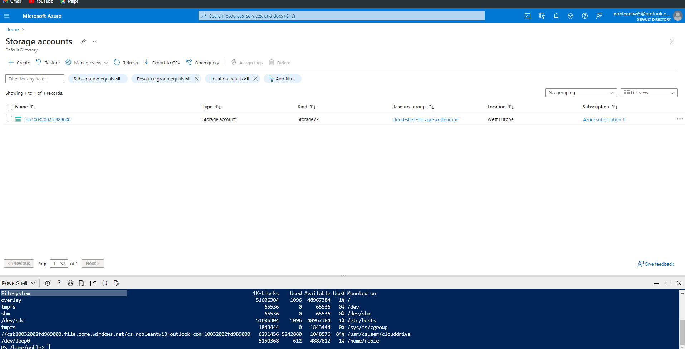

Within the storage account blade, I clicked on the link representing the resource group's name, entering a metaphorical room where all the goodies are stored. Navigating to the Tags section, I embarked on the drama of tag creation, assigning a new tag named "Role" with the special value "Infra."

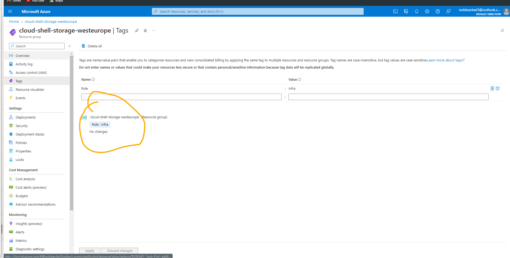

Hitting the 'Apply' button, it felt like casting a wizard's spell as the tag was successfully created, officially tagging the resource group as "Infra." To ensure everything worked as expected, a quick check on the ellipsis and selecting 'Edit tags' revealed that the new tag wasn't automatically assigned. This indicated that, a tag appplied at a Resource Group level does not automatically get applied to Resources in the group.

## Implementing Precision: Azure Policy for Robust Resource Tagging

In the second task, I harnessed the capabilities of Azure Policy to establish and enforce precise tagging standards for resources. Imagine this as providing each resource with a clear identifier, ensuring they navigate the expansive Azure environment with purpose. Navigating the Azure portal, I took on the role of a detective, seeking out the Policy section and exploring Definitions within the Authoring section – essentially consulting Azure's rulebook..

### Navigating the Azure Policy World

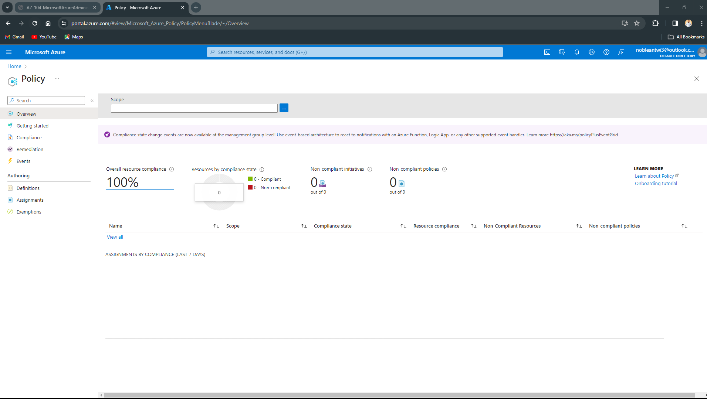

Amidst the array of built-in policies, my attention honed in on the "Require a tag and its value on resources" rule, serving as a robust mechanism to ensure proper labeling. Activating this rule felt like assigning a critical task, prompting Azure to act as a vigilant guardian, ensuring adherence to tagging standards.

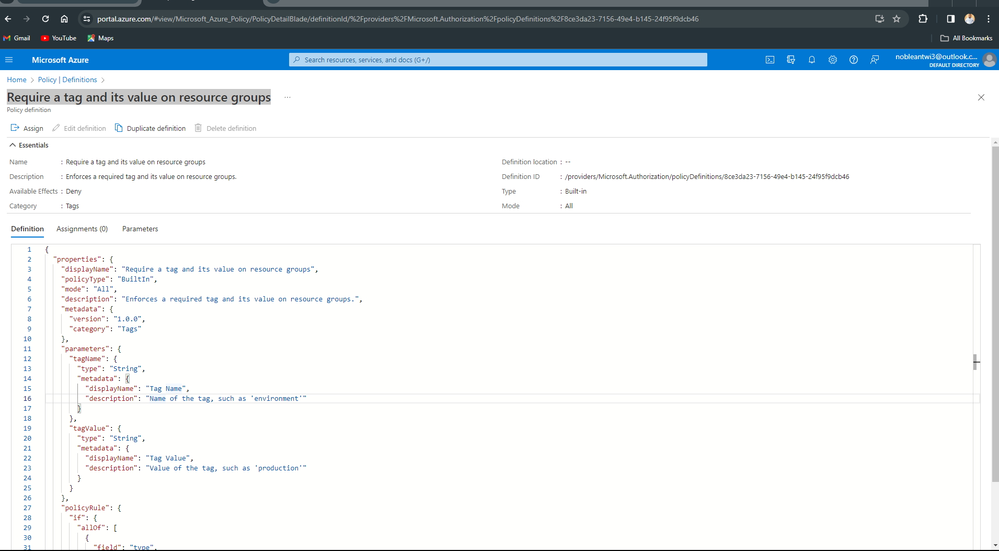

Defining the mission scope, I specified the subscription and resource group where earlier tagging maneuvers had occurred. The task was christened with the name "Require Role tag with Infra value," offering clarity and a touch of sophistication. This meticulous detailing included a description affirming the mission's focus on the Cloud Shell resource group, activating the policy's enforcement mechanisms.

Further customization involved specifying the tag's name as "Role" and its value as "Infra," effectively instructing Azure on the specific tagging requirements. With configurations in place, the deployment of this tagging strategy was initiated by hitting the "Create" button, marking the initiation of a systematic approach to tagging within Azure.

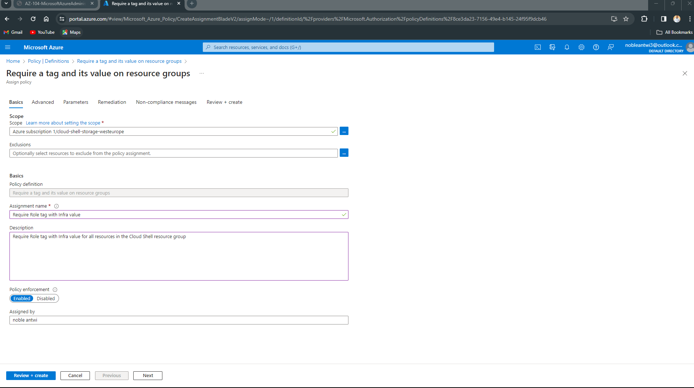

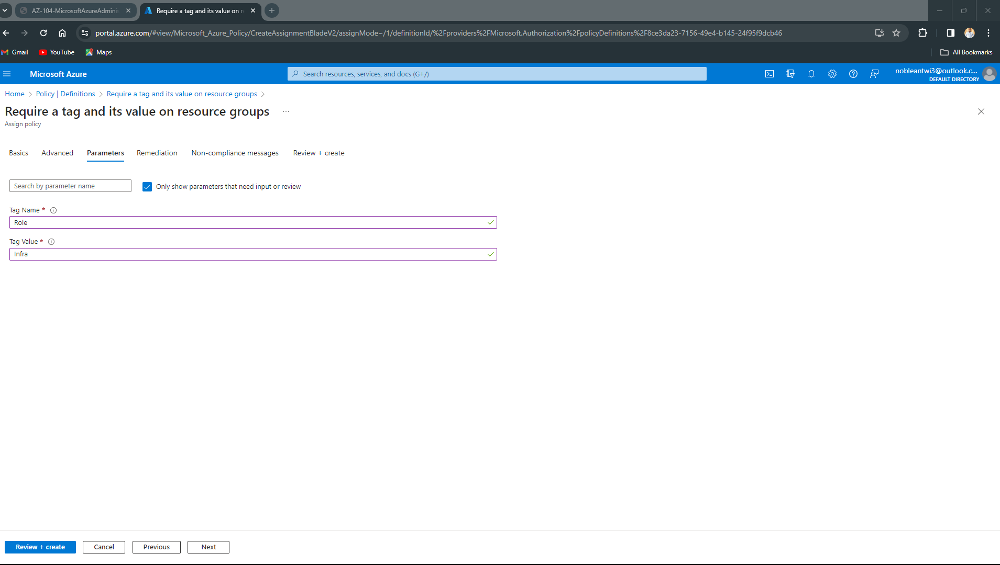

The true litmus test unfolded as I attempted to create a Storage Account without the mandatory tag. The deployment's failure underscored the effectiveness of the policy in preventing the creation of resources without adherence to tagging rules. Investigating the failure through the Notifications list provided insights into the reasons behind the policy intervention. This episode reinforced the notion that, through Azure Policy, a structured and systematic approach to resource tagging was not just established but successfully enforced.

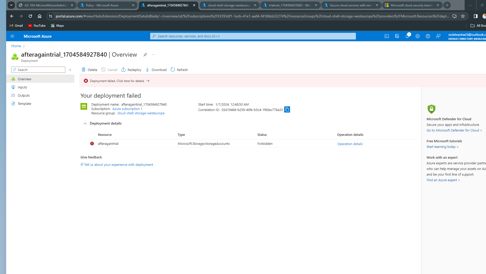

## Revamping Azure Governance: Transitioning from Legacy Policies to Streamlined Tagging Strategies

In the final leg of our Azure governance adventure, I took a practical and efficient approach to ensure all resources align with tagging rules. The first order of business was bidding farewell to the old policy. Navigating back to the Azure portal, I gracefully retired the previous policy assignment by accessing the Policies section and clicking on Assignments. With a click of the delete button, the old policy was ushered out, making way for a fresh perspective.

Embracing a new tagging strategy, I initiated the setup by clicking on "Assign policy." Azure was directed to keep a watchful eye on the same subscription and resource group where our initial tagging magic unfolded. Opting for simplicity, I chose a straightforward plan: if a resource forgets its tag, it should simply inherit it from the resource group. This uncomplicated approach resembled telling resources, "If you forget your tag, borrow it from where you belong."

With a name bestowed upon the new plan – "Inherit the Role tag and its Infra value from the Cloud Shell resource group if missing" – the setup was confirmed with a click of the Create button. No elaborate effects, just a clear and direct configuration. Testing the waters, I created another Storage Account in the same familiar space as before. This time, the process flowed smoothly without any hiccups, indicating the success of the new plan.

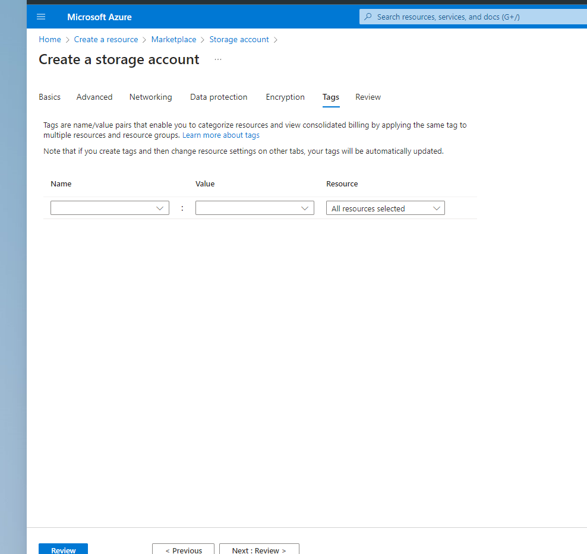

The result was verified by checking the newly created Storage Account, revealing the automatic presence of the "Role" tag with the value "Infra." It was akin to witnessing magic, albeit in its simplest form. This marked the conclusion of our journey – no superhero theatrics, just a smart and pragmatic approach to ensure adherence to tagging rules. For a visual recount of this swift and effective Azure governance episode, check out the GitHub page, akin to a short story showcasing how Azure keeps things impeccably neat and tidy.

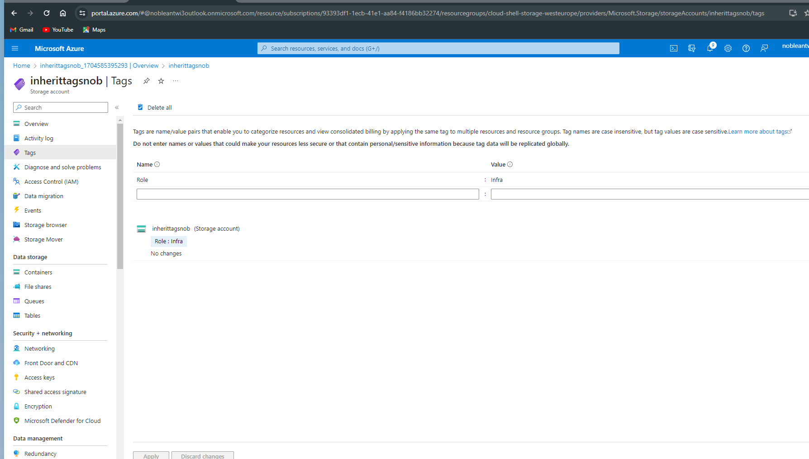
