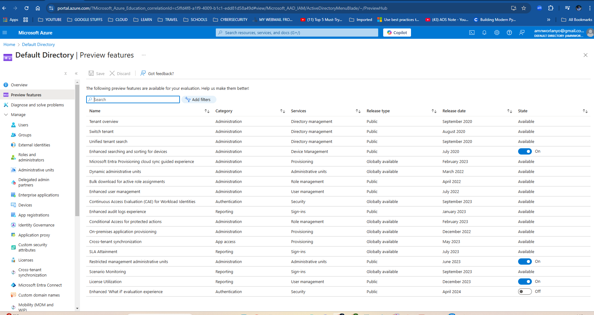

# Dynamic Group Membership in Microsoft Entra ID

Dynamic Groups in Microsoft Entra ID (formerly Azure AD) provide a smart and automated way to manage group memberships. Instead of manually adding or removing members, dynamic groups use rules to include or exclude users based on specific attributes like department, location, or job title. This makes it easy to keep group memberships up-to-date, especially in large organizations where user roles and details frequently change.

With dynamic groups, you can:

- Streamline user and resource management.
- Enhance access control by aligning groups with organizational policies.
- Reduce administrative overhead by automating group memberships.

Dynamic Groups are particularly useful for scenarios like assigning licenses, applying policies, or managing access to resources in a scalable and efficient manner.

For a detailed implementation guide and real-world examples, check out my [YouTube Playlist on Dynamic Groups in Entra ID](https://www.youtube.com/playlist?list=PLfeBBu8bvwXnDxrltcinIAoC6O0od11fm)

