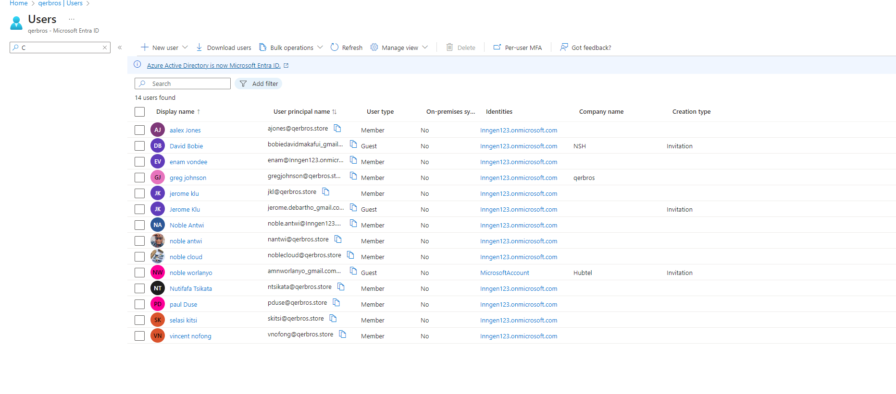
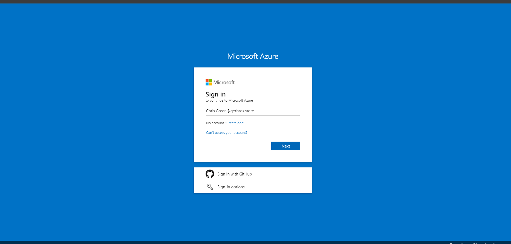
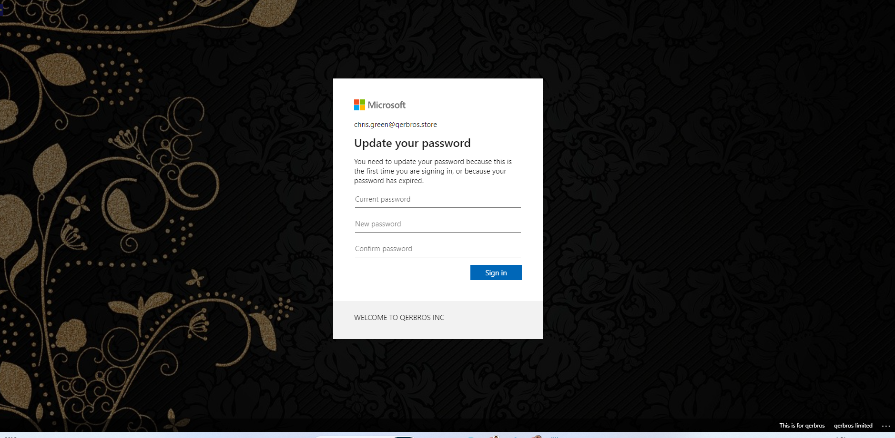
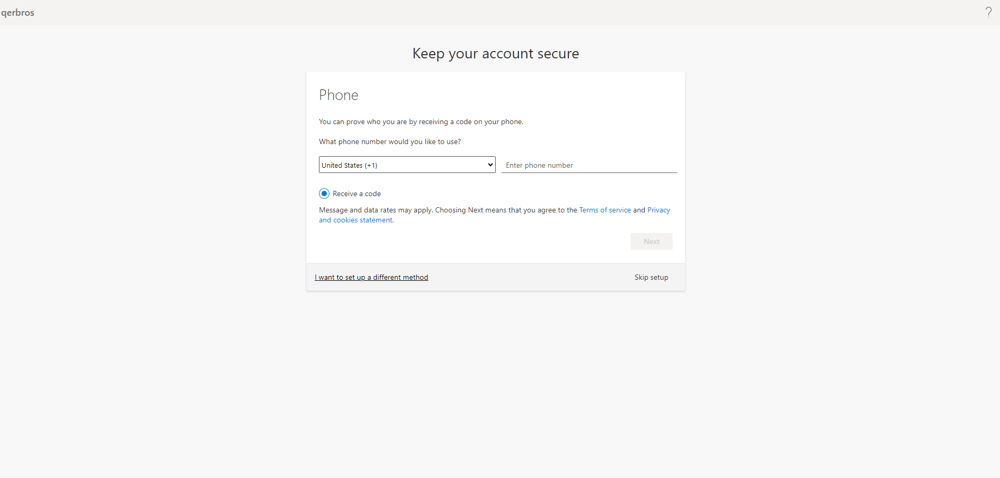
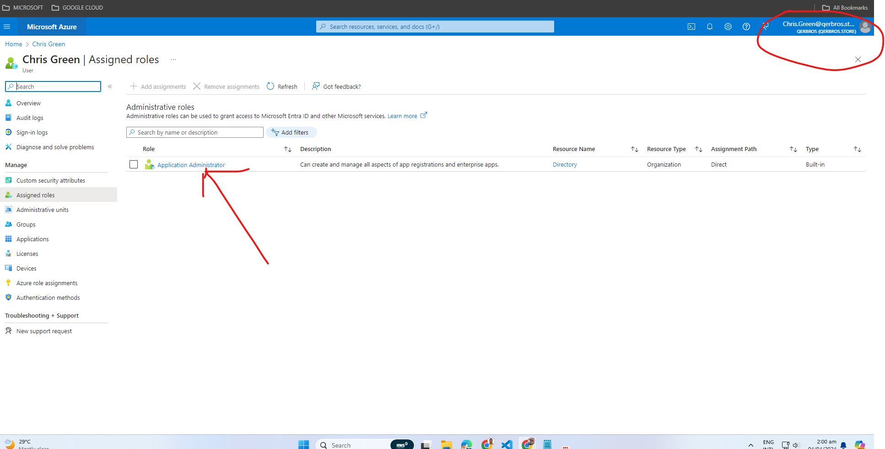

# MANAGING USER ROLES

## Introduction

Managing user roles is a critical aspect of any web application, especially in an e-commerce domain like qerbros.store. Ensuring that users have appropriate access levels is vital for maintaining security and optimizing the user experience. This project aims to develop a system for managing user roles effectively within the qerbros.store platform.

## Objective

The primary objective of this project is to implement a user role management system that allows administrators to assign and modify roles for users on the qerbros.store platform. Specifically, the focus will be on providing users with the necessary roles to perform their tasks efficiently while maintaining security and access control.

## Steps Taken

1. User Creation: Initially, users are created within the qerbros.store platform with basic user credentials but without any assigned roles.

2. Role Assignment: Upon login, new users realize they do not have any specific role assigned to them, leading to potential access limitations.

3. Assigning Application Administrator Role: To address this issue, the administrator assigns roles to new users. In this project, the focus was on assigning the role of "Application Administrator" to newly created users.

Verification: After role assignment, users are able to view their assigned roles, specifically identifying themselves as "Application Administrators" within the qerbros.store platform.

## Project Documentation

### User Creation

Users are created using the platform's user management interface.
Basic user information such as username, email, and password is collected during the registration process.
](media/002_CreatingNewUserBasics.png)

](media/003_CreatingNewUserEnd.png)

### Role Assignment

Upon registration, new users are directed to their account dashboard where they can view their profile information.
Users notice the absence of any assigned roles, which prompts them to seek assistance from the administrator.

### Assigning Application Administrator Role

The administrator, upon receiving a request from a new user, accesses the user management section of the platform.
From the user management interface, the administrator selects the newly created user and assigns the role of "Application Administrator."
This role assignment grants the user access to privileged features and functionalities within the qerbros.store platform.

### Verification

After role assignment, users log in to their accounts and navigate to their profile settings.
In the profile settings section, users can now see their assigned role displayed as "Application Administrator."

This confirmation assures users of their access rights within the platform, facilitating smoother navigation and task execution.

## Conclusion

Effective management of user roles is crucial for maintaining security and optimizing user experience within the qerbros.store platform. By implementing a systematic approach to role assignment, users can seamlessly access the functionalities they require to fulfill their roles effectively. This project lays the foundation for future enhancements in user role management, ensuring the scalability and security of the qerbros.store platform.

## Future Scope

1. Explore additional roles and permissions to cater to different user responsibilities.
2. Implement role-based access control (RBAC) for more granular control over user permissions.
3. Implement Priviledge Identity Management.
4. Enhance the user interface to provide better visibility and management of assigned roles.
